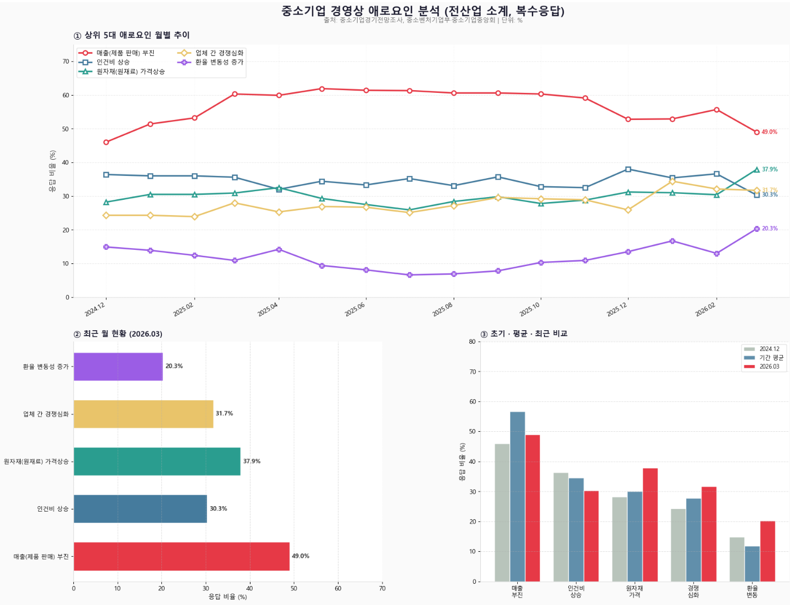

# AI 담당 기능 소개
 
## 목차
1. [기획 배경](#0-기획-배경)
2. [광고 내용 기반 예산 및 노출 수 예측](#1-광고-내용-기반-예산-및-노출-수-예측)
3. [비정형 음성 데이터 요약 및 챗봇](#2-비정형-음성-데이터-요약-및-챗봇)
4. [게시글 신뢰 지수 예측](#3-게시글-신뢰-지수-예측)
---
 
## 0. 기획 배경
 
중소기업경기전망조사(중소벤처기업부·중소기업중앙회) 데이터를 분석한 결과,  
국내 중소기업이 겪는 경영상 애로요인은 아래와 같이 확인되었습니다.
 

 
| 순위 | 애로요인 | 응답 비율 (2026.03 기준) |
|---|---|---|
| 1 | 매출(제품 판매) 부진 | 49.0% |
| 2 | 원자재(원재료) 가격상승 | 37.9% |
| 3 | 업체 간 경쟁심화 | 31.7% |
| 4 | 인건비 상승 | 30.3% |
| 5 | 환율 변동성 증가 | 20.3% |
 
2024년 12월부터 2026년 3월까지의 월별 추이를 분석한 결과,  
**매출 부진**이 전 기간에 걸쳐 압도적 1위를 유지하고 있으며,  
**원자재 가격상승**은 초기 대비 최근 들어 응답 비율이 상승하는 추세를 보입니다.
 
이러한 데이터를 근거로, 중소기업 간 **거래·협업 활성화**와 **광고 비용 효율화**를 지원하는 플랫폼의 필요성을 확인하고 본 서비스를 기획하였습니다.
 
---
 
## 1. 광고 내용 기반 예산 및 노출 수 예측
 
`Okt` · `CountVectorizer` · `코사인 유사도` · `가중 평균` 활용
 
광고의 제목과 내용을 분석하여 적정 예산과 예상 노출 수를 자동으로 예측하는 기능입니다.  
형태소 분석기(Okt)로 명사를 추출한 뒤, CountVectorizer로 벡터화하여 기존 광고 데이터와의 코사인 유사도를 계산합니다.  
상위 5개 유사 광고에 유사도 기반 가중 평균을 적용하여 예산 및 노출 수 예측값을 산출합니다.
 
| 처리 단계 | 설명 |
|---|---|
| 1. 텍스트 입력 | 광고 제목 및 내용 수신 |
| 2. 형태소 분석 | Okt를 사용하여 명사 추출 |
| 3. 벡터화 | CountVectorizer로 텍스트를 벡터로 변환 |
| 4. 유사도 계산 | 기존 광고 데이터와 코사인 유사도 비교 |
| 5. 가중 평균 | 상위 5개 유사 광고에 유사도 가중치 적용 |
| 6. 결과 반환 | 예상 예산(최소·최대·평균) 및 노출 수 반환 |
 
### 주요 코드
 
**데이터 로드 및 DB 연결**
 
```python
import os
import pandas as pd
import numpy as np
from sqlalchemy import create_engine
from dotenv import load_dotenv
 
load_dotenv()
 
db_url = f"postgresql://{os.getenv('DB_USER')}:{os.getenv('DB_PASSWORD')}@{os.getenv('DB_HOST')}:{os.getenv('DB_PORT')}/{os.getenv('DB_NAME')}"
engine = create_engine(db_url)
 
df = pd.read_sql("SELECT * FROM tbl_advertisement", engine)
```
 
**형태소 분석 및 유사도 기반 예측**
 
```python
from sklearn.feature_extraction.text import CountVectorizer
from sklearn.metrics.pairwise import cosine_similarity
from konlpy.tag import Okt
 
okt = Okt()
 
# 제목 + 설명 결합 후 명사 추출
pre_df = df.title + " " + df.description
count_v = CountVectorizer()
count_matrix = count_v.fit_transform(pre_df.apply(lambda x: " ".join(okt.nouns(x))))
 
# 새 광고 입력 및 벡터화
ad_contents = " ".join(okt.nouns("예측할 광고 내용 입력"))
new_ad_matrix = count_v.transform([ad_contents])
 
# 코사인 유사도 계산 및 상위 5개 추출
sim_scores = cosine_similarity(new_ad_matrix, count_matrix)
sim_indices = sim_scores.argsort()[0][::-1][:5]
sim_ads = df.iloc[sim_indices]
 
# 유사도 가중 평균으로 예산·노출 수 예측
new_ad_sim_scores = sim_scores[0][sim_indices]
predicted_budget    = np.dot(new_ad_sim_scores, sim_ads['budget'].values) / new_ad_sim_scores.sum()
predicted_impression = np.dot(new_ad_sim_scores, sim_ads['impression_estimate'].values) / new_ad_sim_scores.sum()
 
print(f"예상 예산: {predicted_budget:.2f}  (최소: {sim_ads['budget'].min():.2f} / 최대: {sim_ads['budget'].max():.2f})")
print(f"예상 평균 노출 수: {predicted_impression:.2f}")
```
 
**Spring → FastAPI 호출 (AiAPIController.java)**
 
```java
// 광고 예산 추천 시스템 (평균 예산, 최고/최저 예산값, 평균 노출 수)
@PostMapping("ad/recommend")
@ResponseBody
public Flux<AiAdResponse> recommendBudget(@RequestBody AdvertisementDTO request) {
 
    return webClient.post()
            .uri("/api/ai/ad")
            .contentType(MediaType.APPLICATION_JSON)
            .bodyValue(request)
            .retrieve()
            .bodyToFlux(AiAdResponse.class);
}
```
 
---
 
## 2. 비정형 음성 데이터 요약 및 요약
 
`OpenAI STT (Whisper)` · `LangChain` · `PromptTemplate` · `Redis 캐싱` 활용
 
화상 통화 녹화 파일을 S3에서 가져와 STT로 텍스트 변환 후, LangChain 기반 무역 전문 프롬프트로 회의 결과 보고서를 자동 생성하는 기능입니다.  
Redis 캐싱을 적용하여 동일 파일 경로로 재요청 시 LLM 호출 없이 즉시 반환하여 API 비용을 절감합니다.
 
| 처리 단계 | 설명 |
|---|---|
| 1. 요청 수신 | Spring에서 파일 경로를 FastAPI로 전달 |
| 2. Redis 캐시 확인 | 동일 파일 경로의 요약 결과가 있으면 즉시 반환 |
| 3. S3 다운로드 | Presigned URL을 통해 녹화 파일 취득 |
| 4. STT 변환 | OpenAI Whisper 모델로 음성 → 텍스트 변환 |
| 5. 프롬프트 구성 | 무역 전문 PromptTemplate에 변환 텍스트 주입 |
| 6. LLM 요약 | LangChain Chain으로 회의 결과 보고서 생성 |
| 7. 캐시 저장 | 요약 결과를 Redis에 저장 (TTL 적용) |
| 8. 결과 반환 | 요약 보고서 텍스트 반환 |
 
### 주요 코드
 
**Spring → FastAPI 요약 요청 (AiAPIController.java)**
 
```java
// 녹화 파일 요약 요청
@PostMapping("video-chat/summation")
@ResponseBody
public Mono<SummationResponse> summationRecord(@RequestBody SummationRequest request) {
    log.info("fileId: {}", request.getFileId());
    log.info("filePath: {}", request.getFilePath());
 
    Map<String, Object> body = new HashMap<>();
    body.put("file_id", request.getFileId());
    body.put("file_path", request.getFilePath());
 
    return webClient.post()
            .uri("/api/ai/summary")
            .contentType(MediaType.APPLICATION_JSON)
            .bodyValue(body)
            .retrieve()
            .bodyToMono(SummationResponse.class);
}
```
 
**Redis 캐시 확인 → S3 다운로드 → STT 변환 (ai_service.py)**
 
```python
async def summarize(self, record) -> str:
 
    # 1. Redis 캐시 확인 (file_path 기준)
    #    동일한 파일 경로로 이미 요약된 결과가 있으면
    #    LLM 호출 없이 즉시 반환 → API 비용 절감
    cache_key = f"summary:{record.file_path}"
    cached_summary = redis_client.get(cache_key)
 
    if cached_summary:
        print(f"캐시 히트: {cache_key}")
        return cached_summary
 
    # 2. S3 Presigned URL 발급 → 오디오 다운로드
    url = s3_client.generate_presigned_url(
        'get_object',
        Params={'Bucket': BUCKET_NAME, 'Key': record.file_path},
        ExpiresIn=3600
    )
    audio_bytes = requests.get(url).content
 
    # 3. STT 변환 (Whisper)
    transcript = self.model_of_STT.audio.transcriptions.create(
        model="gpt-4o-mini-transcribe",
        file=(record.file_path, audio_bytes)
    )
    content = transcript.text
```
 
**무역 전문 프롬프트 구성 및 LangChain 요약 후 캐시 저장 (ai_service.py)**
 
```python
    # 4. 무역 전문 프롬프트 + LangChain 요약
    template = """
        # Role
        너는 10년 차 베테랑 국제 무역 실무자이자 회의록 작성 전문가야.
        복잡한 수입/수출 회의 내용을 분석하여 실무자가 바로 참조할 수 있는 '무역 회의 결과 보고서'를 작성해줘.
 
        # Format
        1. 회의 개요       - 일시 및 참여 업체 / 주요 안건
        2. 품목 및 가격 조건 - 대상 품목 / 합의 단가 및 수량 / 통화(Currency)
        3. 물류 및 인도 조건 - Incoterms 2020 / ETD·ETA / 선적·도착 항구
        4. 결제 및 행정 사항 - 결제 방식 / 주요 서류 요구사항
        5. 주요 합의 사항   - 양측이 최종 동의한 핵심 내용
        6. 향후 과제       - 업체별 Action Items (기한 포함) / 차기 미결 안건
 
        # Tone & Style
        - 전문적이고 간결한 비즈니스 문체 사용
        - 수치와 날짜는 반드시 정확하게 추출할 것
        - 모호한 내용은 '확인 필요'로 표시할 것
 
        # Input Data
        {content}
    """
    prompt = PromptTemplate(input_variables=["content"], template=template)
    chain = prompt | self.model | StrOutputParser()
 
    result = await chain.ainvoke({'content': content})
 
    # 5. 요약 결과를 Redis에 저장
    #    동일한 file_path로 다시 요청이 오면 캐시 히트
    redis_client.setex(cache_key, CACHE_TTL, result)
    print(f"캐시 저장 완료: {cache_key} (TTL: {CACHE_TTL}초)")
 
    return result
```
 
---
 
## 3. 게시글 신뢰 지수 예측
 
`Kiwi` · `CountVectorizer` · `Naive Bayes (MultinomialNB)` · `Pipeline` 활용
 
게시글의 제목과 본문 내용을 분석하여 해당 게시글의 신뢰 등급을 예측하는 기능입니다.  
Kiwi 형태소 분석기로 조사·어미를 제거한 뒤, MultinomialNB 분류 모델로 정상·의심·검표 필요 3단계 등급을 분류합니다.
 
| 처리 단계 | 설명 |
|---|---|
| 1. 데이터 로드 | CSV 데이터 로드 및 결측치·중복 제거 |
| 2. 클래스 균형 | 언더샘플링으로 클래스 불균형 해소 |
| 3. 형태소 분석 | Kiwi로 조사·어미 제거 후 표제어 추출 |
| 4. 모델 학습 | CountVectorizer + MultinomialNB Pipeline 학습 |
| 5. 결과 반환 | 정상(0) / 의심(1) / 검표 필요(2) 등급 반환 |
 
### 주요 코드
 
**데이터 전처리 및 형태소 분석**
 
```python
import pandas as pd
from kiwipiepy import Kiwi
 
kiwi = Kiwi()
josa_tags = ["JKS","JKC","JKO","JKG","JKB","JKV","JKQ","JX","JC",
             "EC","EF","EP","ETN","ETM"]
 
def removes_josa(sentence):
    result = []
    for token in kiwi.tokenize(sentence):
        if token.tag in josa_tags:
            continue
        result.append(token.lemma)
    return " ".join(result)
 
post_df = pd.read_csv('./datasets/trade_classification_data.csv')
post_df.dropna(subset=['title', 'content'], inplace=True)
post_df.drop_duplicates(inplace=True, ignore_index=True)
 
# 제목 + 내용 결합 및 형태소 분석 적용
pre_p_df = post_df.copy()
pre_p_df['text'] = pre_p_df.title + " " + pre_p_df.content
pre_p_df['text'] = pre_p_df['text'].apply(removes_josa)
```
 
**Pipeline 모델 학습 및 저장**
 
```python
from sklearn.feature_extraction.text import CountVectorizer
from sklearn.naive_bayes import MultinomialNB
from sklearn.pipeline import Pipeline
from sklearn.model_selection import train_test_split
import joblib
 
X_train, X_test, y_train, y_test = train_test_split(
    pre_p_df.text, pre_p_df.target, stratify=pre_p_df.target, test_size=0.2, random_state=124
)
 
m_nb_pipe = Pipeline([
    ('count_vectorizer', CountVectorizer()),
    ('multinomial_NB', MultinomialNB(alpha=0.2))
])
 
m_nb_pipe.fit(X_train.values, y_train)
print("정확도:", m_nb_pipe.score(X_test.values, y_test))
 
joblib.dump(m_nb_pipe, 'post_score.pkl')
```
 
**예측 예시**
 
```python
# 정상 게시글 예측
m_nb_pipe.predict(['호주산 철광석 장기 계약 바이어 모집 CIF 부산 기준 월 300톤 정기 구매 희망합니다. T/T 결제 가능하며 원산지 증명서 및 선적 서류 완비 필수입니다.'])
# → [0] 정상
 
# 의심 게시글 예측
m_nb_pipe.predict(['창고에 한가득 있는데 자리가 없어서 빨리 비워야 해요. 뭔지는 연락주시면 말씀드릴게요.'])
# → [1] 의심
 
# 검표 필요 게시글 예측
m_nb_pipe.predict(['부업으로 월 800 버는 방법 공유합니다. 불법 아니고 자세한 방법은 오픈채팅방 들어오시면 설명드려요.'])
# → [2] 검표 필요
```
 
**FastAPI 서비스 추론 (ai_service.py)**
 
```python
async def calc_trust_score(self, request):
    nb_pipe = joblib.load("./model/post_score.pkl")
    predictions = nb_pipe.predict([request.text])
 
    return {"score": int(predictions)}
```
 
**Spring → FastAPI 호출 (AiAPIController.java)**
 
```java
// 게시글 신뢰도 측정
@PostMapping("post/trust")
@ResponseBody
public Mono<AiPostResponse> calcTrustScore(@RequestBody Map<String, String> request) {
    String text = request.get("text");
    log.info("받아온 문장: {}", text);
 
    return webClient.post()
            .uri("/api/ai/post")
            .contentType(MediaType.APPLICATION_JSON)
            .bodyValue(Map.of("text", text))
            .retrieve()
            .bodyToMono(AiPostResponse.class);
}
```
